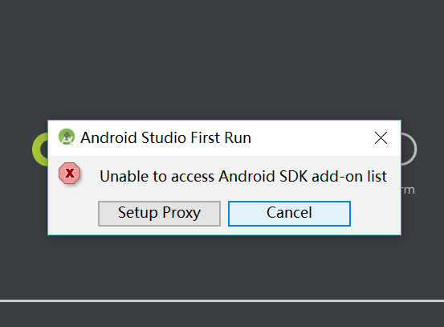

### Cordova环境配置
#### 软件准备
1. JDK kit8 [现成资源](https://pan.baidu.com/s/1BSsaVC5uh6-IvreP_s84VQ)，提取码hgeq
2. Android studio，用来装android SDK(26)  
      因为直接从谷歌下载安卓sdk被墙，要下载很久，所以可以直接用[现成资源](https://pan.baidu.com/s/1pAWxwBGPMa2RGCZZG-mN9g)，提取码: 4km9
3. node.js
4. Webstrom，可编辑vue项目

#### 安装注意事项  
1. node.js请到英文官网下载，选择“Recommended for Most Users"的版本，截止当前写此文是10.13.0LTS版本  
2.  
